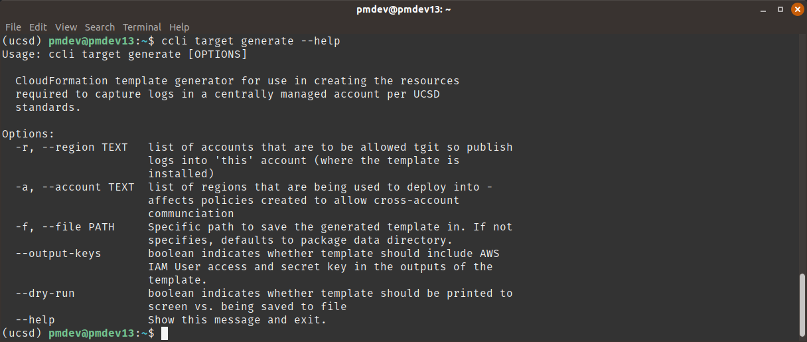
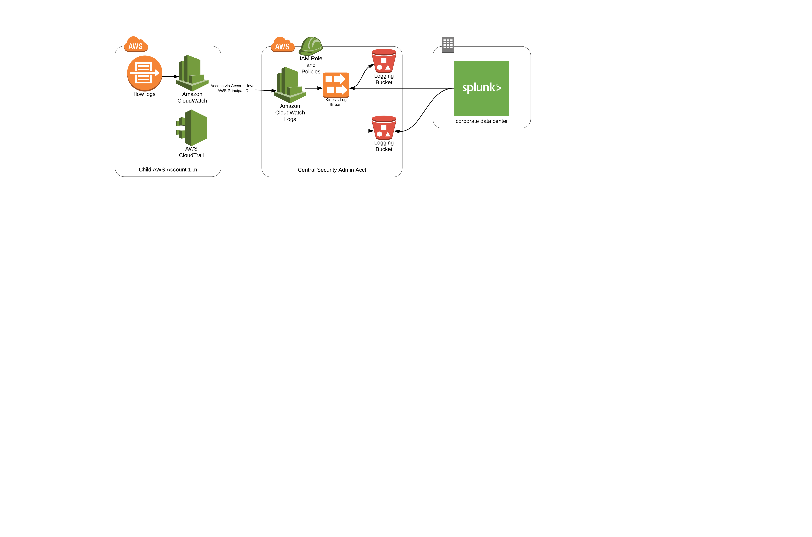

# UCSD-Cloud-Cli 0.1.0

This toolset is designed to enable command-line-level access to common functions related to the security workflow(s) defined within this readme document for the UCSD team to use when configuring their Amazon Web Services environment(s).

## Development Environment Prerequisites

To work on this toolset, you will need several basic requirements installed:

* Python 3.6
* [virtualenv](https://pypi.python.org/pypi/virtualenv)
* [virtualenvwrapper](https://virtualenvwrapper.readthedocs.io/en/latest/)

Assuming you're working on a mac and have [homebrew](https://brew.sh) installed, the following will install these prerequisites:

```bash
brew install python3
pip3 install virtualenv
pip3 install virtualenvwrapper
```

`virtualenvwrapper` also requires a bit of configuration locally to ensure that it can be used from the terminal properly. Per it's [documentation](https://virtualenvwrapper.readthedocs.io/en/latest/#introduction) you'll want to souce the init script in any terminal session you want to use the toolset in. Additionally, as we're working in python3, you'll want to set an environment variable to indicate to `virtualenvwrapper` which python executable to use. This can be accomplished with the following command, either run in the terminal each time you want to use it, or otherwise added to your environment via `~/.bashrc` or `/etc/bashrc`:

```bash
VIRTUALENVWRAPPER_PYTHON=/usr/local/bin/python3
source /usr/local/bin/virtualenvwrapper.sh
```

## Dependencies and Packages

This toolset leverages the [boto3](https://boto3.readthedocs.io/en/latest/) sdk when interacting with Amazon Web Services' API's and [click](http://click.pocoo.org/5/) to handle the command-line experience and interface. Additionally, [troposphere](https://github.com/cloudtools/troposphere) is used to compose CloudFormation templates to avoid string-based JSON errors and other easy to make mistakes. 

## Click CLI

Click offers a simple CLI integration toolset that has a rich set of parsers and help functions to make the user's experience as simple as possible.


The top level help shows the various commands available. Since this is a hierarchical set of commands, there are a few different pathways to manage logging source and target CloudFormation scripts/deployments.  



This image shows the help string when a user is attempting to generate the log target CloudFormation script. Note that details are pulled from the [docstring](https://www.python.org/dev/peps/pep-0257/) for the description of the command.


The above shows the CLI prompting the user for values including multi-value inputs that are parsed as comma separated value strings. To enable this at the command line, set the `CLI_PROMPT` environment variable to `TRUE`:

```bash
export CLI_PROMPT=TRUE
```

# Process Flows




# Test Data

| Name | Account ID |
|------|------------|
| Secuity Test Account | 802640662990 |
| UCSD Test | 969379222189 |
| Infrastructure Test Account | 169929244869 |
